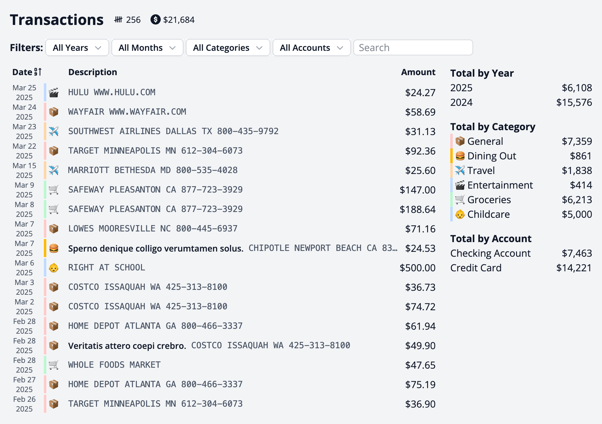

#  Summer

Summer is a terrible pun, and also the app I use to track my spending. You probably should not use it. In case you're curious, here's what it looks like:



## Setup

### Docker Compose (Recommended)

The easiest way to run Summer is with Docker Compose, which includes a built-in SurrealDB instance:

1. Clone the repository: `git clone https://github.com/eventualbuddha/summer.git`
2. Run with Docker Compose: `docker compose up`
3. Open http://localhost:3000 in your browser
4. Click "Use Built-in Database" to get started immediately

The built-in database uses the `summer` namespace and `summer` database by default. Your data is persisted in a Docker volume.

### Self-Hosted

1. Clone the repository: `git clone https://github.com/eventualbuddha/summer.git`
2. Install [Node.js](https://nodejs.org/) (v25 or later)
3. Install dependencies: `npm install`
4. Build the app: `npm run build`
5. Start the server: `npm start`

**Option A: Use built-in SurrealDB**

1. Install and start [SurrealDB](https://surrealdb.com/) locally
2. Set environment variables:
   ```bash
   export BACKEND_SURREALDB_URL=ws://localhost:8000
   export DEFAULT_NAMESPACE=summer
   export DEFAULT_DATABASE=summer
   ```
3. Start the server: `npm start`
4. Open http://localhost:3000 and click "Use Built-in Database"

**Option B: Connect to external SurrealDB**

1. Start the server without environment variables: `npm start`
2. Open http://localhost:3000
3. Click "Connect to External Database"
4. Enter your SurrealDB instance URL, namespace, and database

### Development

For development with hot reload:

```bash
npm run dev
```

This runs the app without the built-in backend. You'll need to connect to an external SurrealDB instance.

Alternatively, start a local SurrealDB and the production server:

```bash
# Terminal 1: Start SurrealDB
surreal start --log info --bind 0.0.0.0:8000 --unauthenticated --allow-all memory

# Terminal 2: Set env vars and start server
export BACKEND_SURREALDB_URL=ws://localhost:8000
export DEFAULT_NAMESPACE=summer
export DEFAULT_DATABASE=summer
npm run build
npm start
```

### Cloud

TBD. I'd like to host it somewhere static and just connect directly to SurrealDB from the browser, but haven't worked out exactly how to do that yet.

## License

MIT License
