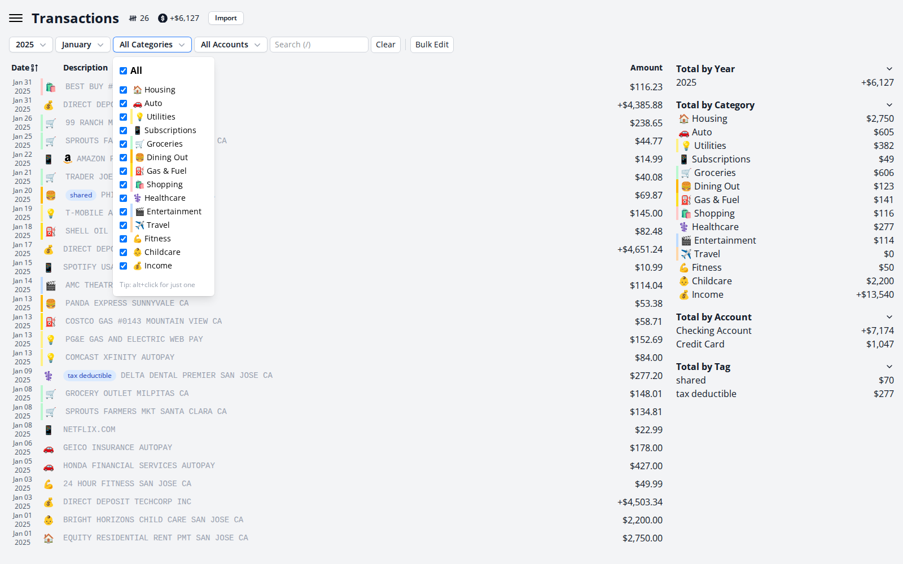
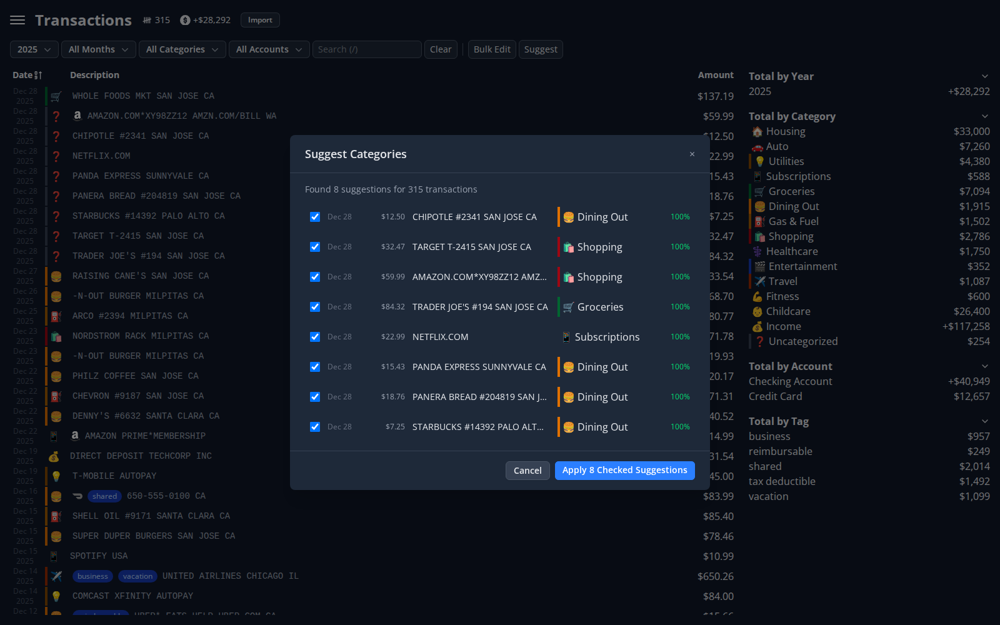
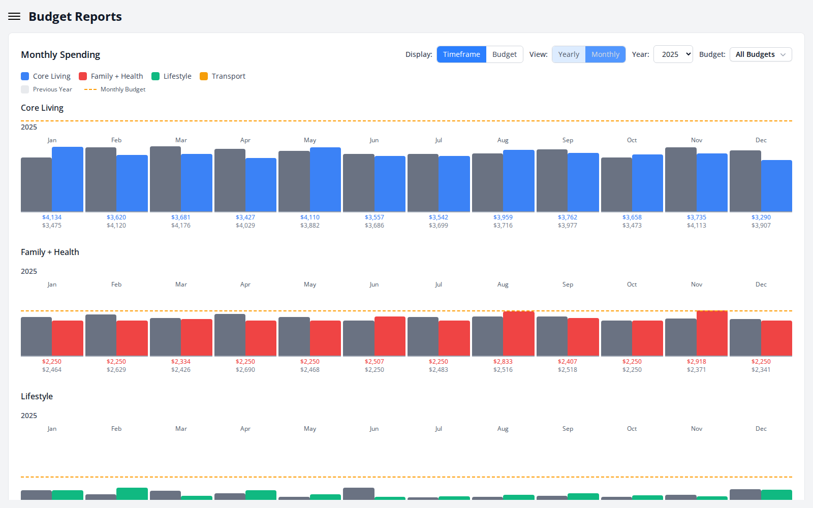
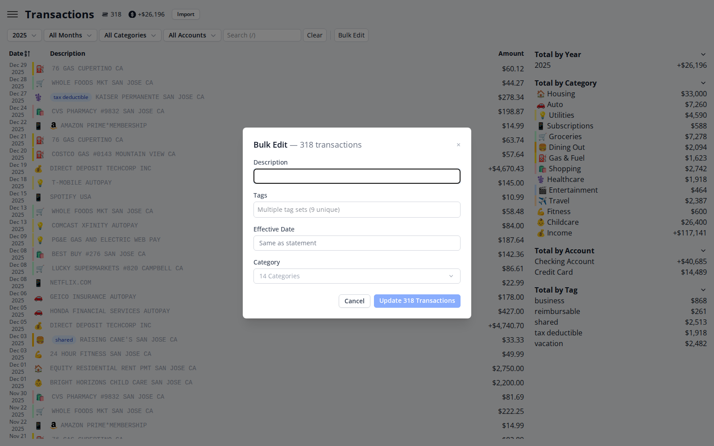

#  Summer

Summer is a personal finance app for tracking spending, managing budgets, and reviewing trends over time. It imports bank statements in PDF format, automatically categorizes transactions based on past history, and supports vim-style keyboard navigation for efficient review.

Here are a few views from the app (click any image to open the full-size version):

<table>
  <tr>
    <td align="center">
      <a href="static/screenshots/transactions-filtered-with-category-dropdown.png">
        
      </a>
      <br>
      <sub>Transactions: filtered + category dropdown</sub>
    </td>
    <td align="center">
      <a href="static/screenshots/transactions-dark-mode.png">
        
      </a>
      <br>
      <sub>Auto-categorize: suggest modal (dark mode)</sub>
    </td>
  </tr>
  <tr>
    <td align="center">
      <a href="static/screenshots/budget-reports-monthly.png">
        
      </a>
      <br>
      <sub>Budget reports: monthly chart</sub>
    </td>
    <td align="center">
      <a href="static/screenshots/transactions-bulk-edit-modal.png">
        
      </a>
      <br>
      <sub>Transactions: bulk edit modal</sub>
    </td>
  </tr>
</table>

## Features

- **Statement import**: Upload bank statement PDFs directly from the transactions view. Summer parses and stores them automatically, deduplicating transactions across statements.
- **Filtering and search**: Filter the transaction list by year, month, category, account, or tag. Search by description, bank name, or amount using a structured query syntax (e.g. `desc:starbucks`, `amount:gt:50`, `tag:reimbursable`).
- **Auto-categorization**: Click "Suggest" to analyze your transaction history and propose categories for uncategorized transactions, ranked by confidence. High-confidence matches (≥80%) are pre-checked so you can apply them in one click.
- **Vim-style keyboard navigation**: Navigate transactions with `j`/`k`, jump to the top or bottom with `g`/`G`, focus the filters with `f`, and open the keyboard shortcuts reference with `?`.
- **Budget reports**: Define budgets by category group and year, then track spending with monthly trend charts and per-category breakdowns.

## Setup

### Docker Compose (Recommended)

The easiest way to run Summer is with Docker Compose, which includes a built-in SurrealDB instance:

1. Clone the repository: `git clone https://github.com/eventualbuddha/summer.git`
2. Run with Docker Compose: `docker compose up`
3. Open http://localhost:3000 in your browser

The database uses the `summer` namespace and `summer` database by default. Data is persisted on the host via a volume mount.

### Self-Hosted

1. Clone the repository: `git clone https://github.com/eventualbuddha/summer.git`
2. Install [Node.js](https://nodejs.org/) (v25 or later)
3. Install and start [SurrealDB](https://surrealdb.com/) locally
4. Install dependencies: `npm install`
5. Build the app: `npm run build`
6. Set environment variables and start the server:
   ```bash
   export SURREALDB_URL=http://localhost:8000
   npm start
   ```
7. Open http://localhost:3000

#### Environment Variables

| Variable              | Default   | Description              |
| --------------------- | --------- | ------------------------ |
| `SURREALDB_URL`       | (none)    | SurrealDB connection URL |
| `SURREALDB_NAMESPACE` | `summer`  | SurrealDB namespace      |
| `SURREALDB_DATABASE`  | `summer`  | SurrealDB database name  |
| `PORT`                | `3000`    | Server port              |
| `HOST`                | `0.0.0.0` | Server bind address      |

### Development

For development with hot reload:

```bash
npm run dev
```

This automatically starts a local SurrealDB instance and the Vite dev server.

## Screenshot Generation

README screenshots are generated with Playwright using the `create-demo` dataset.

- Generate local screenshots into `static/screenshots/`:
  ```bash
  npm run screenshots:readme
  ```
- Generate screenshots in CI artifact format:
  ```bash
  npm run test:screenshots
  ```

The screenshot suite captures:

- Transactions (filtered view with Categories dropdown open)
- Auto-categorize: suggest categories modal (dark mode)
- Budget Reports (monthly chart view for the previous complete year)
- Bulk Edit modal

## License

MIT License
